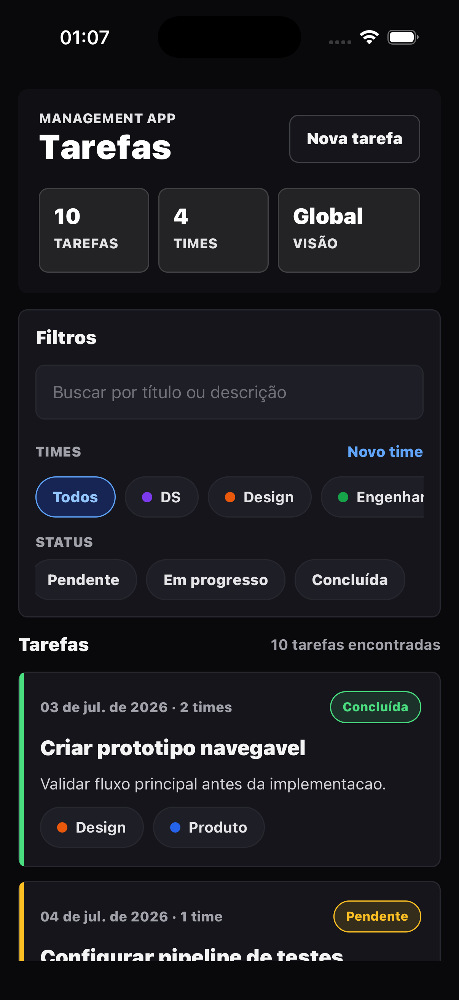
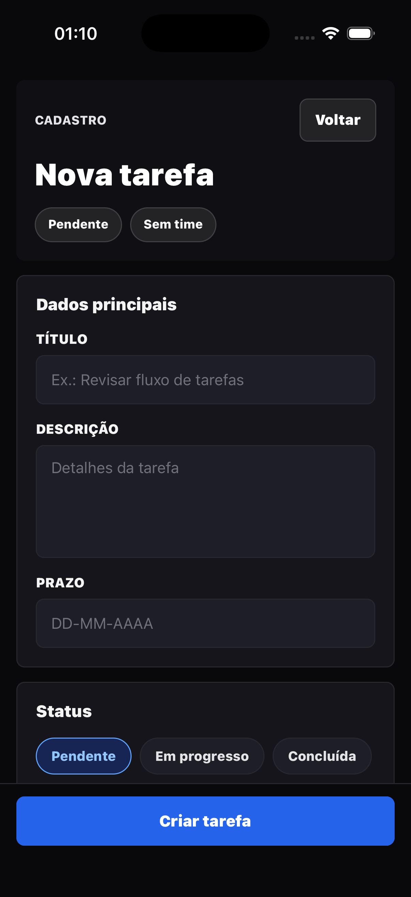
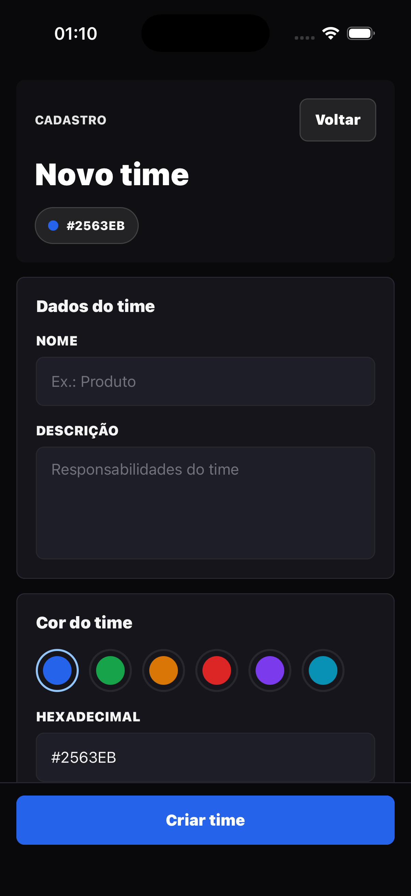
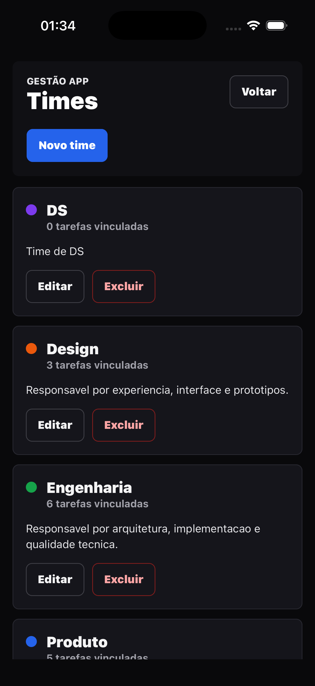
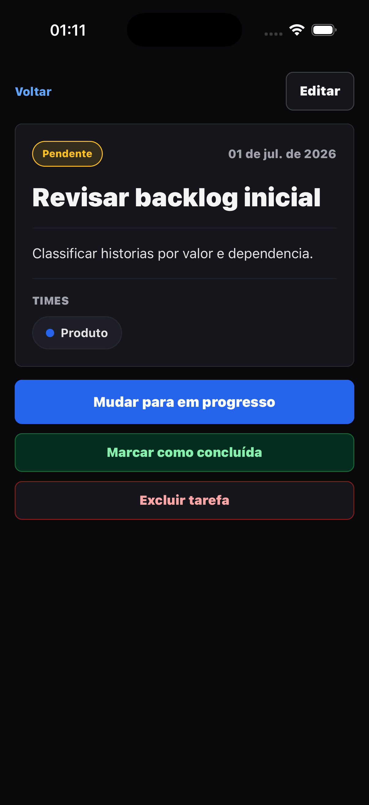
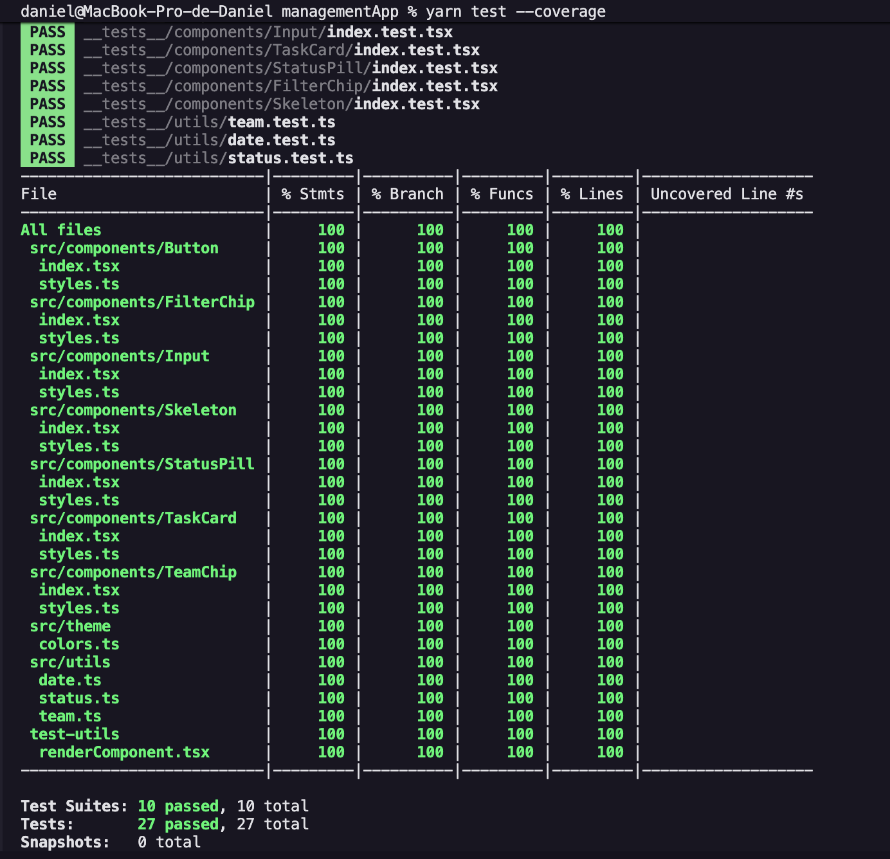

# Gestão APP

Aplicacao mobile em React Native e TypeScript para gerenciar times e tarefas consumindo a Management API.

## Stack

- React Native 0.86
- TypeScript
- React Navigation
- TanStack React Query para server state
- Zustand para filtros locais
- React Hook Form + Zod para validacao de formulario
- Axios para HTTP
- React Native StyleSheet para UI, sem styled-components

## Decisoes arquiteturais

O app separa responsabilidades em camadas simples:

- `src/services`: contrato HTTP, tipos da API e funcoes de request.
- `src/hooks`: hooks de React Query para buscar e mutar dados.
- `src/store`: estado local de filtros da lista.
- `src/screens`: telas de lista, detalhe e formulario.
- `src/components`: componentes reutilizaveis de tarefa, status e time.
- `src/config`: configuracao de ambiente e React Query persistido.

Cada tela segue o mesmo padrao de organizacao:

- `index.tsx`: somente interface/renderizacao.
- `useContainer.ts`: regras de tela, navegacao, queries, mutations e handlers.
- `types.ts`: tipos e interfaces da tela.
- `styles.ts`: estilos da tela.

Componentes reutilizaveis ficam em pasta propria, por exemplo `StatusPill/index.tsx`,
com `types.ts` e `styles.ts` no mesmo diretorio.

React Query foi escolhido porque a maior parte do estado vem do backend. Ele simplifica cache, loading, erro, refetch e invalidacao apos criar, editar, excluir ou alterar status. Zustand ficou restrito a filtros de UI, porque esse estado nao precisa ir para o backend.

O formulario usa `react-hook-form` com `zod` para validar no cliente antes de enviar para a API. A regra principal do desafio, titulo com minimo de 3 caracteres, esta refletida no schema da tela de tarefa.

O app usa cache persistido com AsyncStorage e NetInfo para funcionar offline-first. Consultas ja carregadas ficam disponiveis offline e mutations pausadas sao reenviadas quando a conexao volta.

## Funcionalidades implementadas

- Lista e gerenciamento de times.
- Criar time.
- Editar time.
- Deletar time.
- Toque em um time para filtrar tarefas por `teamId`.
- Lista global e filtrada de tarefas.
- Filtro por status e busca textual.
- Criar tarefa.
- Editar tarefa.
- Visualizar tarefa.
- Alterar status rapidamente.
- Marcar tarefa como concluida.
- Deletar tarefa.
- Exibir times como chips com cor.

## Evidencias visuais

Prints capturados no iOS Simulator com o app apontando para a API de producao.

| Lista e filtros | Nova tarefa |
| --- | --- |
|  |  |

| Novo time | Gerenciar times | Detalhe da tarefa |
| --- | --- | --- |
|  |  |  |

### Cobertura de testes

Evidencia do comando `yarn test --coverage` com cobertura 100%.



## Backend esperado

Este front consome a API em:

```text
http://localhost:3000/api
```

Em producao, o app esta configurado para:

```text
https://management-api-y4gi.onrender.com/api
```

A documentacao Swagger da API publicada esta disponivel em:

```text
https://management-api-y4gi.onrender.com/api/docs
```

No iOS Simulator, `localhost` aponta para a maquina host. No Android Emulator, o app usa `10.0.2.2`.

As URLs ficam em arquivos de ambiente:

- `.env.local`: API local.
- `.env.production`: API publicada.

Antes de rodar um build, aplique o ambiente desejado:

```bash
yarn env:local
yarn env:prod
```

O comando gera `src/config/environment.ts`, que e o arquivo importado pelo cliente Axios. O arquivo `.env.production` ja aponta para a API publicada no Render usada neste desafio.

O backend usado no desafio esta no repositorio [dannyelgjl/management-api](https://github.com/dannyelgjl/management-api).

Endpoints consumidos:

```text
GET    /api/teams?limit=&offset=&search=
GET    /api/teams/:id
POST   /api/teams
PUT    /api/teams/:id
DELETE /api/teams/:id
GET    /api/tasks?teamId=&status=&search=&limit=&offset=&sort=
GET    /api/tasks/:id
POST   /api/tasks
PUT    /api/tasks/:id
PATCH  /api/tasks/:id/status
DELETE /api/tasks/:id
```

## Exemplos de requests

Use estes exemplos com o backend local rodando em `http://localhost:3000/api`.

### Listar times

```bash
curl "http://localhost:3000/api/teams?limit=10&offset=0&search=eng"
```

### Criar time

```bash
curl -X POST "http://localhost:3000/api/teams" \
  -H "Content-Type: application/json" \
  -d '{
    "name": "Produto",
    "colorHex": "#2563EB",
    "description": "Time responsavel por descoberta e priorizacao."
  }'
```

### Editar time

```bash
curl -X PUT "http://localhost:3000/api/teams/{teamId}" \
  -H "Content-Type: application/json" \
  -d '{
    "name": "Produto e Design",
    "colorHex": "#7C3AED",
    "description": "Time responsavel por discovery, interface e priorizacao."
  }'
```

### Deletar time

```bash
curl -X DELETE "http://localhost:3000/api/teams/{teamId}"
```

### Listar tarefas com filtros, ordenacao e paginacao

```bash
curl "http://localhost:3000/api/tasks?teamId={teamId}&status=PENDING&search=api&limit=3&offset=0&sort=createdAt:desc"
```

### Criar tarefa

```bash
curl -X POST "http://localhost:3000/api/tasks" \
  -H "Content-Type: application/json" \
  -d '{
    "title": "Criar API REST",
    "description": "Implementar CRUD de times e tarefas.",
    "status": "PENDING",
    "dueDate": "2026-07-01T12:00:00.000Z",
    "teamIds": ["{teamId}"]
  }'
```

### Alterar status

```bash
curl -X PATCH "http://localhost:3000/api/tasks/{taskId}/status" \
  -H "Content-Type: application/json" \
  -d '{ "status": "DONE" }'
```

## Como rodar

### 1. Subir backend

Em outro terminal, no repositorio da API:

```bash
git clone https://github.com/dannyelgjl/management-api.git
cd management-api
nvm use
docker compose up -d
cp .env.example .env
npm install
npm run db:migrate
npm run seed
npm run start:dev
```

### 2. Subir frontend

Neste projeto mobile, use Yarn:

```bash
git clone https://github.com/dannyelgjl/management-app.git
cd management-app
nvm use
yarn install
bundle install
cd ios && bundle exec pod install && cd ..
yarn start:local --reset-cache
yarn ios:local
```

## Scripts

- `yarn start`: inicia Metro.
- `yarn ios`: compila e abre no iOS Simulator.
- `yarn android`: compila e abre no Android Emulator.
- `yarn test`: roda testes.
- `yarn test --coverage`: roda testes com cobertura.
- `yarn lint`: roda ESLint.
- `yarn env:local`: aplica ambiente local.
- `yarn env:prod`: aplica ambiente de producao.

## Modelo de dados consumido

```text
Team
- id
- name
- colorHex
- description
- tasksCount

Task
- id
- title
- description
- status: PENDING | IN_PROGRESS | DONE
- dueDate
- teams[]
```

Uma tarefa pode ter zero, um ou varios times. Ao enviar o formulario, `teamIds` substitui os vinculos anteriores quando a tarefa ja existe.

## O que faria diferente em producao

- Autenticacao e controle por usuario/organizacao.
- Optimistic updates em acoes de status.
- Observabilidade de erros com Sentry ou similar.
- Testes de componentes cobrindo fluxos de formulario e filtros.
- Design system compartilhado com tokens de cor, espacamento e tipografia.
